  

  
  
  

---

I build focused Swift packages — each one solves a single problem properly, ships with real documentation, and carries a test suite that runs in CI. Most are SwiftUI-first and depend on nothing but Apple's own frameworks.

## Featured

### [WaveformKit](https://github.com/GRimAce11/WaveformKit) — Interactive audio waveforms for SwiftUI

 

Decoding, disk caching, realtime FFT, pinch-to-zoom, markers, VoiceOver. Zero dependencies, Swift 6, zero-allocation audio callbacks.

### [Keel](https://github.com/GRimAce11/Keel) — Create and maintain iOS projects from the terminal

 

Swift 6 / SwiftUI project generator with optional AI analysis. Installable via Homebrew.

### [MarqueeKit](https://github.com/GRimAce11/MarqueeKit) — Scrolling text and content for SwiftUI and UIKit

 

Smart overflow detection — it works out whether scrolling is needed. Adaptive speed, edge fading, haptics, synchronised groups.

## More packages

<table>
<tr><th align="left">Package</th><th align="left">What it does</th><th align="left">Stars</th></tr>
<tr><td><a href="https://github.com/GRimAce11/Strata"><b>Strata</b></a></td><td>Declarative SwiftData migrations — Safe by default, testable in CI, introspectable when things go wrong.</td><td></td></tr>
<tr><td><a href="https://github.com/GRimAce11/FlowMotion"><b>FlowMotion</b></a></td><td>Motion infrastructure for SwiftUI — Analytical spring solver, shared-element hero transitions, Canvas liquid morphing, timeline DSL.</td><td></td></tr>
<tr><td><a href="https://github.com/GRimAce11/SwiftL10n"><b>SwiftL10n</b></a></td><td>Localisation linting for Swift — Catches hardcoded strings, missing assets, and stale translations before they ship.</td><td></td></tr>
<tr><td><a href="https://github.com/GRimAce11/Hoist"><b>Hoist</b></a></td><td>Type-safe feature flags for Swift — Lightweight, with polling, exposure dedup, and analytics hooks.</td><td></td></tr>
</table>

## How I work

- **Documentation is part of the deliverable.** Every package ships a README that explains the *why*, not just the API surface. WaveformKit adds a DocC catalogue hosted on Swift Package Index.
- **CI gates everything.** Builds run warnings-as-errors under the Swift 6 language mode, across every platform the package claims to support.
- **Known limitations are written down.** If something is not supported, it says so in the README rather than surprising you at integration time.

## Elsewhere

  

